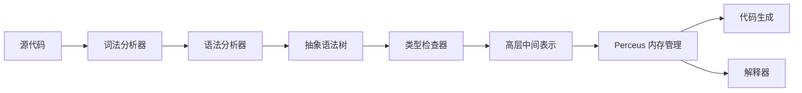

# CLAUDE.md

本文件为 Claude Code (claude.ai/code) 提供在本仓库工作时的指导规范。

## 最高优先级规则
[DESIGN_GOALS.md](DESIGN_GOALS.md) 是 X 语言所有设计与实现决策的**宪法性最高权威文件**。如果任何其他文档（包括本 CLAUDE.md）与 DESIGN_GOALS.md 冲突，以设计目标文档为准。进行任何设计选择时，请优先查阅 DESIGN_GOALS.md。

## examples 目录规则

`examples/` 目录由用户亲自维护，Claude 必须遵守以下规则：

1. **禁止修改用户示例**：Claude 不得修改、删除或覆盖 `examples/` 目录下任何用户编写的 `.x` 或 `.zig` 文件。
2. **保证可编译可运行**：当用户在 `examples/` 中编写示例代码时，Claude 必须确保代码能够通过编译并正确运行。如果编译或运行失败，Claude 应修复编译器/运行时的问题，而非修改用户的示例代码。
3. **可以修改编译器**：如果示例代码暴露了编译器 bug 或缺失的特性，Claude 应修复编译器代码，使示例能够正常工作。

## 项目概览

X 语言是一门现代化编程语言，具有自然语言风格的关键字（`needs`、`given`、`wait`、`when`/`is`、`can`、`atomic`）、数学函数表示法、显式效果/错误类型（R·E·A），以及 Perceus 风格的内存管理（编译期 dup/drop、复用分析）。支持函数式、声明式、面向对象和过程式多种编程范式。

**当前阶段**：第一阶段已基本完成：词法分析器、语法分析器、AST 和树遍历解释器已实现。类型检查器、HIR、Perceus 和多代码生成后端（Zig、LLVM、JavaScript、JVM、.NET）均以 crate 形式存在，完成度各不相同。Zig 后端是最成熟的，支持核心语言特性。官方语言规范见 [spec/](spec/)（参见 [spec/README.md](spec/README.md)）；[README.md](README.md) 是项目介绍。

## 构建系统

本项目使用 **Cargo**（Rust 包管理器），不使用 Buck2。

### Zig 编译器依赖

Zig 后端需要安装 Zig 0.13.0 或更高版本，并将其添加到 PATH 环境变量中。Zig 用于生成本地和 Wasm 代码，自带 LLVM 后端，因此 Zig 后端无需单独安装 LLVM。

Zig 下载地址：https://ziglang.org/download/

验证安装：
```bash
zig version
```

### 常用命令

```bash
# 构建 CLI
cd tools/x-cli && cargo build
cd tools/x-cli && cargo build --release

# 运行 .x 文件（解析 + 解释执行）
cd tools/x-cli && cargo run -- run <file.x>

# 检查语法和类型
cd tools/x-cli && cargo run -- check <file.x>

# 编译：完整流程；--emit 用于调试
cd tools/x-cli && cargo run -- compile <file.x> [-o output] [--emit tokens|ast|hir|pir|zig] [--no-link]
# 使用 Zig 后端（最成熟）：生成 Zig 代码并编译为可执行文件或 Wasm
cd tools/x-cli && cargo run -- compile hello.x -o hello

# 运行所有编译器单元测试
cd compiler && cargo test

# 运行单个测试
cd compiler && cargo test -p <crate> <test_name>
# 示例：运行语法分析器测试
cd compiler && cargo test -p x-parser parse_function

# 运行规格测试
cargo run -p x-spec
# 或：./test.sh（同时运行单元测试和规格测试）

# 运行示例
cd tools/x-cli && cargo run -- run ../../examples/hello.x
cd tools/x-cli && cargo run -- run ../../examples/fib.x

# 构建并运行基准测试（推荐使用 Zig 后端）
cd examples && ./build_benchmarks.sh --backend zig && cd ..
```

### 示例目录

`examples/` 目录包含：
- **基准测试程序**：来自计算机语言基准测试游戏的 10 个程序（binary_trees、fannkuch_redux 等）
- **build_benchmarks.sh/build_benchmarks.ps1**：使用不同后端构建和运行所有基准测试的脚本
- **expected/**：基准测试程序的预期输出
- **README.md**：基准测试的详细说明和运行方法

## 架构

编译器流水线（当前和目标）如下：



| 阶段       | 处理过程     | IR / 输出       | Crate 位置               |
|------------|--------------|-----------------|--------------------------|
| 1          | 词法分析     | 令牌流          | `compiler/x-lexer`        |
| 2          | 语法分析     | AST             | `compiler/x-parser`       |
| 3          | 类型检查     | (带类型的 AST/HIR) | `compiler/x-typechecker` |
| 4          | HIR 生成     | HIR（无类型）   | `compiler/x-hir`          |
| 5          | Perceus 分析 | dup/drop/复用   | `compiler/x-perceus`      |
| 6          | 代码生成     | 多后端          | `compiler/x-codegen`      |
| (备选路径) | 解释执行     | 从 AST 直接运行 | `compiler/x-interpreter`  |
| CLI        | 命令行接口   | 二进制文件      | `tools/x-cli`             |

### 代码生成后端

| 后端 | 状态 | 描述 |
|---------|--------|-------------|
| Zig | ✅ 成熟 | 编译为 Zig 代码，然后使用 Zig 编译器生成本地或 Wasm 二进制文件。大部分特性已实现。 |
| JavaScript | 🚧 早期 | 编译为 JavaScript，用于浏览器/Node.js。 |
| JVM | 🚧 早期 | 编译为 JVM 字节码。 |
| .NET | 🚧 早期 | 编译为 .NET CIL。 |

**当前实现**：CLI 已完整接入全流水线：
- **run**：源代码 → 解析 → 类型检查 → 解释执行
- **check**：源代码 → 解析 → 类型检查
- **compile**：源代码 → 解析 → 类型检查 → HIR → Perceus → 代码生成 → 可执行文件/目标文件。使用 `--emit tokens|ast|hir|pir|zig` 输出中间阶段结果。

## Crate 职责

| Crate           | 位置 | 用途 |
|-----------------|----------|---------|
| x-cli           | `tools/x-cli` | CLI 二进制文件（run、compile、check、format、package、repl）。编排编译流水线。 |
| x-lexer         | `compiler/x-lexer` | 词法分析。从源代码生成令牌流。 |
| x-parser        | `compiler/x-parser` | 语法分析。构建 AST（程序、声明、表达式、类型）。 |
| x-hir           | `compiler/x-hir` | 高层中间表示（解析后、类型检查前）。目前是桩实现。 |
| x-typechecker   | `compiler/x-typechecker` | 类型检查和语义分析。错误类型已定义；逻辑大部分是桩实现。 |
| x-perceus       | `compiler/x-perceus` | Perceus 风格分析（dup/drop、复用）。已实现；集成待完成。 |
| x-codegen       | `compiler/x-codegen` | 通用代码生成基础设施 + Zig 后端。XIR（X 中间表示）定义。 |
| x-codegen-js    | `compiler/x-codegen-js` | JavaScript 后端。 |
| x-codegen-jvm   | `compiler/x-codegen-jvm` | JVM 后端。 |
| x-codegen-dotnet | `compiler/x-codegen-dotnet` | .NET 后端。 |
| x-interpreter   | `compiler/x-interpreter` | 基于 AST 的树遍历解释器。供 `run` 命令使用。 |
| x-stdlib        | `library/stdlib` | 精简标准库：Option、Result 等语言核心类型。 |
| x-spec          | `spec/x-spec` | 规格测试运行器。TOML 测试用例，可选择性关联 README 章节引用。 |

## 测试

- **单元测试**：每个 crate 的 `#[cfg(test)]` 模块中。使用 `cd compiler && cargo test` 运行。
- **规格测试**：位于 `spec/x-spec`。TOML 测试用例包含 `source`、`exit_code`、`compile_fail`、`error_contains`，可选 `spec = ["section"]` 关联到 [spec/](spec/) 中的规范章节。使用 `cargo run -p x-spec` 或顶层 `test.sh`（如果已添加）运行。
- **基准测试**：位于 `examples/`。使用 `build_benchmarks.sh` 运行，测试代码生成后端是否符合预期输出。

添加语言特性时，请添加或更新关联到对应 README 章节的规格测试。

## 工业级演进路径

当前实现是「可用的原型」；要达到工业级编译器标准，需按优先级补齐以下能力：

1. **诊断与位置信息**
   - ✅ **已完成**：词法/解析错误携带源码位置（`Span`、`file:line:col`、代码片段）。参见 `x-lexer/span.rs`、`ParseError::SyntaxError { message, span }`、CLI 的 `format_parse_error`。
   - 待完成：类型检查错误、运行时错误也携带 span；多错误收集与恢复（语法分析器可尝试继续解析并报告多条错误）。

2. **类型检查**
   - 现状：`x-typechecker::type_check` 是桩实现，直接返回 `Ok(())`。
   - 待完成：按 README 类型系统实现约束检查、函数签名校验、未定义变量/类型检查等；错误类型携带 span。

3. **语言特性对齐**
   - Zig 后端已支持核心特性：函数、变量、整数、布尔值、if/else、while 循环、打印
   - 缺失：数组、记录/结构体、Option/Result、模式匹配、类/接口、效果系统、Perceus 引用计数

4. **性能**
   - 待完成：大文件/大 AST 下的内存和耗时优化；必要时实现增量解析、LSP 友好接口。

5. **工具链**
   - 待完成：LSP（悬停提示、跳转、诊断）、格式化器实现、包管理和多文件编译。

## 修改语言 / 实现步骤

添加或修改语言特性时，请遵循以下顺序：

1. **更新规范**：根据需要更新 [spec/](spec/)（参见 [spec/README.md](spec/README.md)）和/或 [docs/](docs/)（词法、类型、表达式、函数等）。
2. **更新 x-lexer**：如果需要新的令牌或注释语法。
3. **更新 x-parser**：支持新语法（语法规则和 AST 节点）。
4. **更新 x-hir**：如果修改引入了新的 IR 结构。
5. **更新 x-typechecker**：实现类型规则和语义检查。
6. **更新 x-codegen 或 x-interpreter**：实现代码生成或执行行为。新特性优先支持 Zig 后端。
7. **添加或更新规格测试**：在 `spec/x-spec` 中添加测试，用 `spec = ["section"]` 指向对应的 README 章节。

## 代码风格和日志

- 使用标准 Rust 风格，执行 `cargo fmt` 格式化。
- 编译器诊断优先使用 `log`（如果已采用 `tracing` 也可以）。阶段内部细节使用 `log::debug!`；库代码中避免使用 `println!`，以便通过 `RUST_LOG=debug` 控制日志输出级别。
- 添加新的处理阶段时，考虑每个阶段输出一条高级日志（例如 "词法分析完成"、"类型检查完成"）并附带关键指标。

## 版本控制

本项目使用 **Git**。问题跟踪可保留在 GitHub（或现有工作流）。不要求使用 Jujutsu (jj) 或 bd (beads)。

## 许可证

本项目采用多重开源许可证，你可以任选其一使用、修改和分发：
- MIT 许可证
- Apache 许可证 2.0
- BSD 3-Clause 许可证

详见 [LICENSES.md](LICENSES.md) 获取完整条款。

## 快速参考

- **规范**：[spec/](spec/) - 完整的语言规格说明书（[spec/README.md](spec/README.md) 为目录）
- **运行**：`cd tools/x-cli && cargo run -- run <file.x>` - 运行 .x 文件（解析 + 解释执行）
- **检查**：`cd tools/x-cli && cargo run -- check <file.x>` - 检查语法和类型
- **输出 tokens/AST**：`cd tools/x-cli && cargo run -- compile <file.x> --emit tokens` 或 `--emit ast` - 输出中间表示
- **测试**：
  - 所有单元测试：`cd compiler && cargo test`
  - 规格测试：`cargo run -p x-spec` 或 `./test.sh`
  - 单个测试：`cd compiler && cargo test -p <crate> <test_name>` 例如 `cargo test -p x-parser parse_function`
- **示例**：查看 `examples/` 目录下的示例程序，如 `hello.x`、`fib.x` 等
- **错误**：解析/语法错误会输出 `file:line:col` 与源码片段。
