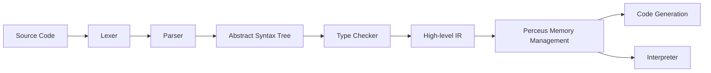

# CLAUDE.md

This file provides guidance to Claude Code (claude.ai/code) when working with code in this repository.

## Highest Priority Rule

[DESIGN_GOALS.md](DESIGN_GOALS.md) is the **constitutional document** for all design and implementation decisions in X language. If any other document (including this CLAUDE.md) conflicts with DESIGN_GOALS.md, the design goals document takes precedence. Always consult DESIGN_GOALS.md before making any design decisions.

## examples Directory Rules

The `examples/` directory is maintained personally by the user. Claude must obey:

1. **Do NOT modify user examples**: Claude must not modify, delete, or overwrite any `.x` or `.zig` files written by the user in the `examples/` directory.
2. **Ensure compilability and runnability**: When the user writes example code in `examples/`, Claude must ensure the code can compile and run correctly. If compilation or execution fails, Claude should fix compiler/runtime issues, not modify the user's example code.
3. **Allow compiler modifications**: If the example code exposes a compiler bug or missing feature, Claude should fix the compiler code to make the example work correctly.

## Project Overview

X is a modern general-purpose programming language with natural language-style keywords (`needs`, `given`, `await`, `when`/`is`, `can`, `atomic`), mathematical function notation, explicit effect/error types (R·E·A), and Perceus-style memory management (compile-time dup/drop, reuse analysis). It supports functional, declarative, object-oriented, and procedural programming paradigms.

**Current status**: Phase 1 is mostly complete: lexer, parser, AST, and tree-walking interpreter are all implemented. Type checker, HIR, Perceus, and multiple code generation backends (Zig, LLVM, JavaScript, JVM, .NET) exist as crates with varying degrees of completion. The Zig backend is the most mature and supports core language features. The official language specification is located at [SPEC.md](./SPEC.md) in the root directory.

## Build System

This project uses **Cargo** (Rust package manager). Buck2 is not used.

### Zig Compiler Dependency

The Zig backend requires Zig 0.13.0 or higher installed and in PATH. Zig is used to generate native and Wasm code, and includes LLVM backend out of the box, so the Zig backend doesn't require a separate LLVM installation.

Download Zig: https://ziglang.org/download/

Verify installation:
```bash
zig version
```

## Common Commands

```bash
# Build CLI
cd tools/x-cli && cargo build
cd tools/x-cli && cargo build --release

# Run .x file (parse + interpret)
cd tools/x-cli && cargo run -- run <file.x>

# Check syntax and types
cd tools/x-cli && cargo run -- check <file.x>

# Compile: full pipeline; --emit for debugging
cd tools/x-cli && cargo run -- compile <file.x> [-o output] [--emit tokens|ast|hir|mir|lir|zig|c|rust|ts|js|dotnet] [--no-link]
# Using Zig backend (most mature): generate Zig code and compile to executable or Wasm
cd tools/x-cli && cargo run -- compile hello.x -o hello

# Run all compiler unit tests
cd compiler && cargo test

# Run a single test
cd compiler && cargo test -p <crate> <test_name>
# Example: run parser test
cd compiler && cargo test -p x-parser parse_function

# Run examples
cd tools/x-cli && cargo run -- run ../../examples/hello.x
cd tools/x-cli && cargo run -- run ../../examples/fib.x

# Format code
cargo fmt
```

## Architecture

Compiler pipeline (current and target):



X compiler uses a classic three-stage architecture: **Frontend → Midend → Backend**.

| Stage | Processing | IR / Output | Crate Location |
|-------|------------|-------------|----------------|
| 1 | Lexical analysis | Token stream | `compiler/x-lexer` |
| 2 | Syntax analysis | AST | `compiler/x-parser` |
| 3 | Type checking | Typed AST/HIR | `compiler/x-typechecker` |
| 4 | HIR generation | HIR (High-level IR) | `compiler/x-hir` |
| 5 | MIR generation | MIR (Mid-level IR) | `compiler/x-mir` |
| 6 | Perceus analysis | dup/drop/reuse | `compiler/x-mir` (formerly `x-perceus`) |
| 7 | LIR generation | LIR (Low-level IR) | `compiler/x-lir` |
| 8 | Code generation | Multiple backends | `compiler/x-codegen` |
| (Alternative) | Interpretation | Run directly from AST | `compiler/x-interpreter` |
| CLI | Command-line interface | Executable | `tools/x-cli` |

### IR Hierarchy

```
AST (Abstract Syntax Tree)
  ↓ lowering
HIR (High-level IR)
  ↓ lowering
MIR (Mid-level IR) ← Perceus memory analysis happens here
  ↓ lowering
LIR (Low-level IR = XIR) ← Unified input for all backends
  ↓
  Backends (Zig, C, Rust, Java, C#, TypeScript, Python, LLVM, ...)
```

### Code Generation Backends

| Backend | Status | Description |
|---------|--------|-------------|
| Zig | ✅ Mature | Compile to Zig source code, then use Zig compiler to generate native or Wasm binary. Most features implemented. |
| C | 🚧 Early | Compile to C source code for maximum portability. |
| Rust | 🚧 Early | Compile to Rust source code for Rust ecosystem interoperability. |
| JavaScript/TS | 🚧 Early | Compile to TypeScript/JavaScript for browser/Node.js. |
| JVM | 🚧 Early | Compile to JVM bytecode (currently via Java source). |
| .NET | 🚧 Early | Compile to .NET CIL (currently via C# source). |
| Python | 🚧 Early | Compile to Python source code. |
| Swift | 📋 Planned | Compile to Swift source code for Apple ecosystem. |
| LLVM | 🚧 Early | Generate LLVM IR for advanced optimizations. |
| Native | 📋 Planned | Direct machine code generation for fast compilation. |

**Current implementation**: CLI fully integrates the complete pipeline:
- **run**: source → parse → type check → interpret
- **check**: source → parse → type check
- **compile**: source → parse → type check → HIR → MIR → LIR → code generation → executable/object file. Use `--emit tokens|ast|hir|mir|lir|zig|c|rust|ts|js|dotnet` to output intermediate results.

## Crate Responsibilities

| Crate | Location | Purpose |
|-------|----------|---------|
| x-cli | `tools/x-cli` | CLI binary (run, compile, check, format, package, repl). Orchestrates the compiler pipeline. |
| x-lexer | `compiler/x-lexer` | Lexical analysis. Generates token stream from source code. Uses the `logos` crate. |
| x-parser | `compiler/x-parser` | Syntax analysis. Builds AST (program, declarations, expressions, types). |
| x-hir | `compiler/x-hir` | High-level intermediate representation (after parsing, before type checking). |
| x-mir | `compiler/x-mir` | Mid-level intermediate representation (control flow graph). Perceus analysis happens here. |
| x-lir | `compiler/x-lir` | Low-level intermediate representation (XIR) - unified input for all backends. |
| x-typechecker | `compiler/x-typechecker` | Type checking and semantic analysis. Error types defined; most logic not yet implemented. |
| x-codegen | `compiler/x-codegen` | Common code generation infrastructure + multiple source output backends (Zig, C, Rust, Java, C#, TS, Python). XIR definition. |
| x-codegen-js | `compiler/x-codegen-js` | JavaScript backend. |
| x-codegen-jvm | `compiler/x-codegen-jvm` | JVM bytecode backend. |
| x-codegen-dotnet | `compiler/x-codegen-dotnet` | .NET CIL backend. |
| x-interpreter | `compiler/x-interpreter` | AST-based tree-walking interpreter. Used by the `run` command. |
| x-stdlib | `library/stdlib` | Minimal standard library: Option, Result and other core language types. |
| x-spec | `spec/x-spec` | (Planned) Specification test runner. TOML test cases, optionally linked to specification sections. |

## Testing

- **Unit tests**: In `#[cfg(test)]` modules in each crate. Run with `cd compiler && cargo test`.
- **Example tests**: Located in `examples/`. Verifies the compiler handles example programs correctly.
- **Specification tests**: (Planned) Located in `spec/x-spec`. TOML test cases will include `source`, `exit_code`, `compile_fail`, `error_contains`, and can optionally link to specification sections.

When adding language features, add or update specification tests linked to the corresponding specification sections.

## Implementation Steps for Adding/Modifying Language Features

When adding or modifying language features, follow this order:

1. **Update specification**: Update [SPEC.md](./SPEC.md) in the root directory (complete syntax and semantic definition) and/or [docs/](docs/) (lexer, types, expressions, functions, etc.) as needed.
2. **Update x-lexer**: If new tokens or comment syntax are needed.
3. **Update x-parser**: Support new syntax (grammar rules and AST nodes).
4. **Update x-hir**: If the modification introduces new IR structures.
5. **Update x-typechecker**: Implement type rules and semantic checks.
6. **Update x-codegen or x-interpreter**: Implement code generation or execution behavior. Prioritize the Zig backend for new features.
7. **Add or update specification tests**: (Planned) Add tests in `spec/x-spec`, using `spec = ["section"]` to point to the corresponding specification section.

## Code Style and Logging

- Use standard Rust style, run `cargo fmt` to format.
- Prefer `log` for compiler diagnostics (`tracing` is also acceptable). Use `log::debug!` for phase internal details; avoid `println!` in library code so log level can be controlled with `RUST_LOG=debug`.
- When adding a new processing phase, consider outputting a high-level log (e.g., "lexical analysis complete", "type checking complete") with key metrics.

## Version Control

This project uses **Git** for version control.

- Commit: `git commit -m "message"`
- Push: `git push origin main`
- Pull: `git pull origin main`

## Development Preferences

- Package manager: Cargo (Rust)
- Backend priority: Zig backend (most mature)
- Test running: `cd compiler && cargo test`

## License

This project is multi-licensed open source software. You can use it under any of the following licenses:
- MIT License
- Apache License 2.0
- BSD 3-Clause License

See [LICENSES.md](LICENSES.md) for full terms.

## Quick Reference

- **Specification**: [SPEC.md](./SPEC.md) - Complete language specification
- **Run**: `cd tools/x-cli && cargo run -- run <file.x>` - Run .x file (parse + interpret)
- **Check**: `cd tools/x-cli && cargo run -- check <file.x>` - Check syntax and types
- **Output IR**: `cd tools/x-cli && cargo run -- compile <file.x> --emit tokens` or `--emit ast|hir|mir|lir`
- **Testing**:
  - All unit tests: `cd compiler && cargo test`
  - Single test: `cd compiler && cargo test -p <crate> <test_name>` e.g., `cargo test -p x-parser parse_function`
- **Examples**: See example programs in the `examples/` directory, such as `hello.x`, `fib.x`
- **Errors**: Parse/syntax errors output in `file:line:col` format with source code snippet
