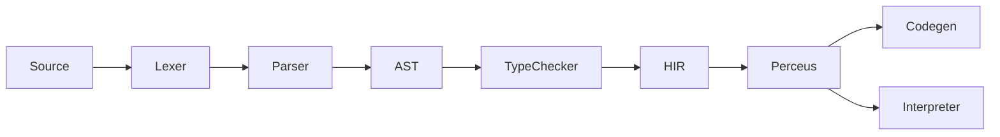

```
# CLAUDE.md

This file provides guidance to Claude Code (claude.ai/code) when working with code in this repository.

## Project Overview

X language is a modern programming language with natural-language-style keywords (`needs`, `given`, `wait`, `when`/`is`, `can`, `atomic`), mathematical function notation, explicit effect/error types (R·E·A), and Perceus-style memory management (compile-time dup/drop, reuse analysis). It supports functional, declarative, OOP, and procedural paradigms.

**Current phase**: Phase 1 largely done: Lexer, Parser, AST, and tree-walk Interpreter. Type checker, HIR, Perceus, and multiple codegen backends (C23, LLVM, JavaScript, JVM, .NET) exist as crates with varying degrees of completeness. The C23 backend is the most mature and supports core language features. The canonical language specification is [README.md](README.md).

## Build System

This project uses **Cargo** (Rust). No Buck2.

### LLVM 21 Dependency

x-codegen-llvm uses inkwell 0.8 with `llvm21-1` feature. If LLVM 21 is installed in a non-standard path, set the environment variable before building:

```bash
# Windows (PowerShell)
$env:LLVM_SYS_211_PREFIX = "C:\Program Files\LLVM"

# Windows (cmd)
set LLVM_SYS_211_PREFIX=C:\Program Files\LLVM

# Linux / macOS
export LLVM_SYS_211_PREFIX=/usr  # or /opt/llvm-21
```

LLVM is not required for:
- Running `x run` (interpreter)
- Running tests without codegen: `cargo test -p x-lexer -p x-parser -p x-typechecker -p x-hir -p x-perceus -p x-interpreter`

### Common Commands

```bash
# Build
cargo build
cargo build --release

# Run a .x file (parse + interpret)
cargo run -- run <file.x>

# Check syntax and types
cargo run -- check <file.x>

# Compile: full pipeline; --emit for debugging
cargo run -- compile <file.x> [-o output] [--emit tokens|ast|hir|pir|llvm-ir|c] [--no-link]
# With C backend (most mature): generates C23 code and compiles to executable
cargo run -- compile hello.x -o hello

# Run all unit tests (requires LLVM for x-codegen-llvm)
cargo test

# Run unit tests without LLVM
cargo test -p x-lexer -p x-parser -p x-typechecker -p x-hir -p x-perceus -p x-interpreter -p x-codegen

# Run a single test
cargo test -p <crate> <test_name>
# Example: Run parser tests
cargo test -p x-parser parse_function

# Run spec tests
cargo run -p x-spec
# or: ./test.sh (runs both unit and spec tests)

# Run examples
cargo run -- run examples/hello.x
cargo run -- run examples/fib.x

# Build and run benchmarks (C backend recommended)
cd examples && ./build_benchmarks.sh --backend c && cd ..
```

### Examples Directory

The `examples/` directory contains:
- **Benchmark programs**: 10 programs from the Computer Language Benchmarks Game (binary_trees, fannkuch_redux, etc.)
- **build_benchmarks.sh/build_benchmarks.ps1**: Scripts to build and run all benchmarks with different backends
- **expected/**: Expected outputs for benchmark programs
- **README.md**: Details about the benchmarks and how to run them

## Architecture

The compiler pipeline (current and target) is:



| Stage       | Pass         | IR / Output     | Crate           |
|------------|--------------|-----------------|-----------------|
| 1          | Lexer        | tokens          | x-lexer         |
| 2          | Parser       | AST             | x-parser        |
| 3          | TypeChecker  | (typed AST/HIR) | x-typechecker   |
| 4          | HIR          | HIR (untyped)   | x-hir           |
| 5          | Perceus      | dup/drop/reuse  | x-perceus       |
| 6          | Codegen      | Multiple backends | x-codegen       |
| (alternate)| Interpreter  | run from AST    | x-interpreter   |

### Codegen Backends

| Backend | Status | Description |
|---------|--------|-------------|
| C23 | ✅ Mature | Compiles to C23, then uses GCC/Clang/MSVC to produce native binaries. Most features implemented. |
| LLVM | 🚧 Partial | Uses inkwell 0.8 (LLVM 21) for native code generation. |
| JavaScript | 🚧 Early | Compiles to JavaScript for browser/Node.js. |
| JVM | 🚧 Early | Compiles to JVM bytecode. |
| .NET | 🚧 Early | Compiles to .NET CIL. |

**Current reality**: The full pipeline is wired in the CLI:
- **run**: Source → Parse → TypeCheck → Interpreter
- **check**: Source → Parse → TypeCheck
- **compile**: Source → Parse → TypeCheck → HIR → Perceus → (optional) Codegen → executable/object file. Use `--emit tokens|ast|hir|pir|llvm-ir|c` to dump intermediate stages.

## Crate Responsibilities

| Crate           | Purpose |
|-----------------|---------|
| x-cli           | CLI binary (run, compile, check, format, package, repl). Orchestrates pipeline. |
| x-lexer         | Tokenization. Produces token stream from source. |
| x-parser        | Parsing. Builds AST (Program, declarations, expressions, types). |
| x-hir           | High-level IR (post-parse, pre-typing). Currently a stub. |
| x-typechecker   | Type checking and semantic analysis. Error types defined; logic mostly stub. |
| x-perceus       | Perceus-style analysis (dup/drop, reuse). Present; integration TBD. |
| x-codegen       | Common codegen infrastructure + C23 backend. XIR (X Intermediate Representation) definition. |
| x-codegen-llvm  | LLVM backend. |
| x-codegen-js    | JavaScript backend. |
| x-codegen-jvm   | JVM backend. |
| x-codegen-dotnet | .NET backend. |
| x-interpreter   | Tree-walk interpreter over AST. Used by `run`. |
| x-stdlib        | Standard library definitions. |
| x-spec          | Specification test runner. TOML cases with optional README section refs. |

## Testing

- **Unit tests**: In each crate under `#[cfg(test)]`. Run with `cargo test`. (Note: full `cargo test` builds x-codegen-llvm which requires LLVM; without LLVM use `cargo test -p x-lexer -p x-parser -p x-typechecker -p x-hir -p x-perceus -p x-interpreter -p x-codegen`.)
- **Spec tests**: In `crates/x-spec`. TOML cases with `source`, `exit_code`, `compile_fail`, `error_contains`, and optional `spec = ["README section"]` for traceability to [README.md](README.md). Run with `cargo run -p x-spec` or a top-level `test.sh` if added.
- **Benchmark tests**: In `examples/`. Run with `build_benchmarks.sh` to test codegen backends against expected outputs.

When adding a language feature, add or update spec tests that reference the relevant README section.

## Path to Industrial-Grade

当前实现是「可用的原型」；要接近工业级编译器，需补齐以下能力（按优先级排序）：

1. **诊断与位置**
   - ✅ **已做**：词法/解析错误带源码位置（`Span`、`file:line:col`、snippet）。见 `x-lexer/span.rs`、`ParseError::SyntaxError { message, span }`、CLI 的 `format_parse_error`。
   - 待做：类型检查错误、运行时错误也带 span；多错误收集与恢复（parser 可尝试继续解析并报告多条错误）。

2. **类型检查**
   - 现状：`x-typechecker::type_check` 为桩，直接返回 `Ok(())`。
   - 待做：按 README 类型系统实现约束检查、函数签名、未定义变量/类型等；错误类型带 span。

3. **语言 Feature Parity**
   - C23 backend supports core features: functions, variables, integers, booleans, if/else, while loops, print
   - Missing: arrays, records/structs, Option/Result, pattern matching, classes/interfaces, effect system, Perceus RC

4. **Performance**
   - 待做：大文件/大 AST 下的内存与耗时；必要时增量解析、LSP 友好接口。

5. **Toolchain**
   - 待做：LSP (hover, jump, diagnostics), formatter implementation, package management and multi-file compilation.

## Modifying the Language / Implementation Steps

When adding or changing language features, follow this order:

1. **Update the specification** in [README.md](README.md) (relevant sections: lexical, types, expressions, functions, etc.).
2. **Update x-lexer** if new tokens or comment syntax are needed.
3. **Update x-parser** for new syntax (grammar and AST nodes).
4. **Update x-hir** if the change introduces new IR constructs.
5. **Update x-typechecker** for type rules and semantic checks.
6. **Update x-codegen or x-interpreter** for code generation or execution behavior. Prioritize the C23 backend for new features.
7. **Add or update spec tests** in `crates/x-spec` with `spec = ["section"]` pointing to README.

## Code Style and Logging

- Use standard Rust style and `cargo fmt`.
- Prefer `log` (or `tracing` if adopted) for compiler diagnostics. Use `log::debug!` for pass-internal details; avoid `println!` in library code so that `RUST_LOG=debug` controls verbosity.
- When adding new passes, consider one high-level log line per pass (e.g. "lexing complete", "typecheck complete") with key metrics.

## Version Control

This project uses **Git**. Issue tracking can stay on GitHub (or existing workflow). No Jujutsu (jj) or bd (beads) requirement.

## Important Environment Variables

- **LLVM_SYS_211_PREFIX**: Required for building x-codegen-llvm. Should point to your LLVM 21 installation directory.

## Quick Reference

- **Spec**: [README.md](README.md) - 完整的语言规格说明书
- **Run**: `cargo run -- run <file.x>` - 运行 .x 文件（解析 + 解释执行）
- **Check**: `cargo run -- check <file.x>` - 检查语法和类型
- **Emit tokens/AST**: `cargo run -- compile <file.x> --emit tokens` 或 `--emit ast` - 输出中间表示
- **Tests**:
  - 所有单元测试：`cargo test`（需要 LLVM）
  - 无 LLVM 的单元测试：`cargo test -p x-lexer -p x-parser -p x-typechecker -p x-hir -p x-perceus -p x-interpreter -p x-codegen`
  - 规格测试：`cargo run -p x-spec` 或 `./test.sh`
  - 单个测试：`cargo test -p <crate> <test_name>` 例如 `cargo test -p x-parser parse_function`
- **Examples**: 查看 `examples/` 目录下的示例程序，如 `hello.x`、`fib.x` 等
- **Errors**: 解析/语法错误会输出 `file:line:col` 与源码片段。
```
