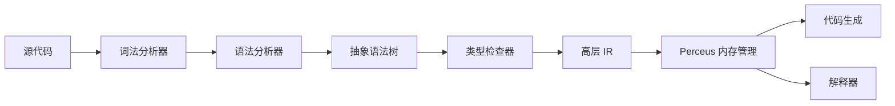

# CLAUDE.md

本文档为 Claude Code (claude.ai/code) 在本代码库工作时提供指导。

## 最高优先级规则

[DESIGN_GOALS.md](DESIGN_GOALS.md) 是 X 语言所有设计和实现决策的**最高宪法文件**。如果任何其他文档（包括本 CLAUDE.md）与 DESIGN_GOALS.md 冲突，以设计目标文档为准。在做出任何设计选择之前，请务必查阅 DESIGN_GOALS.md。

## examples 目录规则

`examples/` 目录由用户亲自维护。Claude 必须遵守以下规则：

1. **不得修改用户示例**：Claude 不得修改、删除或覆盖 `examples/` 目录中用户编写的任何 `.x` 或 `.zig` 文件。
2. **保证可编译可运行**：当用户在 `examples/` 中编写示例代码时，Claude 必须确保代码能够正确编译和运行。如果编译或执行失败，Claude 应该修复编译器/运行时问题，而不是修改用户的示例代码。
3. **允许修改编译器**：如果示例代码暴露了编译器 bug 或缺失功能，Claude 应该修复编译器代码以使示例正常工作。

## 项目概述

X 是一门现代通用编程语言，具有自然语言风格的关键字（`needs`、`given`、`await`、`when`/`is`、`can`、`atomic`）、数学函数表示法、显式效果/错误类型 (R·E·A) 和 Perceus 风格内存管理（编译期 dup/drop、重用分析）。它支持函数式、声明式、面向对象和过程式编程范式。

**当前状态**：第一阶段已基本完成：词法分析器、语法分析器、AST 和树形遍历解释器均已实现。类型检查器、HIR、Perceus 和多个代码生成后端（Zig、LLVM、JavaScript、JVM、.NET）已作为 crate 存在，完成程度各不相同。Zig 后端最为成熟，支持核心语言功能。官方语言规范位于根目录 [SPEC.md](./SPEC.md)。

## 构建系统

本项目使用 **Cargo**（Rust 包管理器）。不使用 Buck2。

### Zig 编译器依赖

Zig 后端需要安装 Zig 0.13.0 或更高版本并在 PATH 中。Zig 用于生成本机代码和 Wasm 代码，开箱即用包含 LLVM 后端，因此 Zig 后端不需要单独安装 LLVM。

下载 Zig：https://ziglang.org/download/

验证安装：
```bash
zig version
```

## 常用命令

```bash
# 构建 CLI
cd tools/x-cli && cargo build
cd tools/x-cli && cargo build --release

# 运行 .x 文件（解析 + 解释执行）
cd tools/x-cli && cargo run -- run <file.x>

# 检查语法和类型
cd tools/x-cli && cargo run -- check <file.x>

# 编译：完整流水线；--emit 用于调试
cd tools/x-cli && cargo run -- compile <file.x> [-o output] [--emit tokens|ast|hir|mir|lir|zig|c|rust|ts|js|dotnet] [--no-link]
# 使用 Zig 后端（最成熟）：生成 Zig 代码并编译为可执行文件或 Wasm
cd tools/x-cli && cargo run -- compile hello.x -o hello

# 运行所有编译器单元测试
cd compiler && cargo test

# 运行单个测试
cd compiler && cargo test -p <crate> <test_name>
# 示例：运行解析器测试
cd compiler && cargo test -p x-parser parse_function

# 运行示例
cd tools/x-cli && cargo run -- run ../../examples/hello.x
cd tools/x-cli && cargo run -- run ../../examples/fib.x

# 格式化代码
cargo fmt
```

## 架构

编译器流水线（当前和目标）：



X 编译器采用经典的三段式架构：**前端 → 中端 → 后端**。

| 阶段 | 处理过程 | IR / 输出 | Crate 位置 |
|------|---------|-----------|------------|
| 1 | 词法分析 | 词法单元流 | `compiler/x-lexer` |
| 2 | 语法分析 | AST | `compiler/x-parser` |
| 3 | 类型检查 | 带类型 AST/HIR | `compiler/x-typechecker` |
| 4 | HIR 生成 | HIR（高层 IR） | `compiler/x-hir` |
| 5 | MIR 生成 | MIR（中层 IR） | `compiler/x-mir` |
| 6 | Perceus 分析 | dup/drop/reuse | `compiler/x-mir`（原 `x-perceus`） |
| 7 | LIR 生成 | LIR（低层 IR） | `compiler/x-lir` |
| 8 | 代码生成 | 多后端 | `compiler/x-codegen` |
| (替代方案) | 解释执行 | 直接从 AST 运行 | `compiler/x-interpreter` |
| CLI | 命令行接口 | 可执行文件 | `tools/x-cli` |

### IR 层次结构

```
AST（抽象语法树）
  ↓ 降阶
HIR（高层 IR）
  ↓ 降阶
MIR（中层 IR） ← Perceus 内存分析在此进行
  ↓ 降阶
LIR（低层 IR = XIR） ← 所有后端的统一输入
  ↓
  后端（Zig, C, Rust, Java, C#, TypeScript, Python, LLVM, ...）
```

### 代码生成后端

| 后端 | 状态 | 描述 |
|------|------|------|
| Zig | ✅ 成熟 | 编译为 Zig 源代码，然后使用 Zig 编译器生成本机或 Wasm 二进制文件。大多数功能已实现。 |
| C | 🚧 早期 | 编译为 C 源代码以获得最大可移植性。 |
| Rust | 🚧 早期 | 编译为 Rust 源代码以便 Rust 生态系统互操作。 |
| JavaScript/TS | 🚧 早期 | 编译为 TypeScript/JavaScript 以供浏览器/Node.js 使用。 |
| JVM | 🚧 早期 | 编译为 JVM 字节码（当前通过 Java 源代码）。 |
| .NET | 🚧 早期 | 编译为 .NET CIL（当前通过 C# 源代码）。 |
| Python | 🚧 早期 | 编译为 Python 源代码。 |
| Swift | 📋 计划中 | 编译为 Swift 源代码以供 Apple 生态系统使用。 |
| LLVM | 🚧 早期 | 生成 LLVM IR 以进行高级优化。 |
| Native | 📋 计划中 | 直接机器代码生成以实现快速编译。 |

**当前实现**：CLI 完全集成了完整流水线：
- **run**：源代码 → 解析 → 类型检查 → 解释执行
- **check**：源代码 → 解析 → 类型检查
- **compile**：源代码 → 解析 → 类型检查 → HIR → MIR → LIR → 代码生成 → 可执行文件/目标文件。使用 `--emit tokens|ast|hir|mir|lir|zig|c|rust|ts|js|dotnet` 输出中间结果。

## Crate 职责

| Crate | 位置 | 用途 |
|-------|------|------|
| x-cli | `tools/x-cli` | CLI 二进制文件（run、compile、check、format、package、repl）。编排编译器流水线。 |
| x-lexer | `compiler/x-lexer` | 词法分析。从源代码生成词法单元流。使用 `logos` crate。 |
| x-parser | `compiler/x-parser` | 语法分析。构建 AST（程序、声明、表达式、类型）。 |
| x-hir | `compiler/x-hir` | 高层中间表示（解析后，类型检查前）。 |
| x-mir | `compiler/x-mir` | 中层中间表示（控制流图）。Perceus 分析在此进行。 |
| x-lir | `compiler/x-lir` | 低层中间表示（XIR）- 所有后端的统一输入。 |
| x-typechecker | `compiler/x-typechecker` | 类型检查和语义分析。已定义错误类型；逻辑大多还未实现。 |
| x-codegen | `compiler/x-codegen` | 通用代码生成基础设施 + 多个源代码输出后端（Zig、C、Rust、Java、C#、TS、Python）。XIR 定义。 |
| x-codegen-js | `compiler/x-codegen-js` | JavaScript 后端。 |
| x-codegen-jvm | `compiler/x-codegen-jvm` | JVM 字节码后端。 |
| x-codegen-dotnet | `compiler/x-codegen-dotnet` | .NET CIL 后端。 |
| x-interpreter | `compiler/x-interpreter` | 基于 AST 的树形遍历解释器。被 `run` 命令使用。 |
| x-stdlib | `library/stdlib` | 最小标准库：Option、Result 和其他核心语言类型。 |
| x-spec | `spec/x-spec` | （计划中）规范测试运行器。TOML 测试用例，可选择链接到规范章节。 |

## 测试

- **单元测试**：在每个 crate 的 `#[cfg(test)]` 模块中。使用 `cd compiler && cargo test` 运行。
- **示例测试**：位于 `examples/`。验证编译器能正确处理示例程序。
- **规范测试**：（计划中）位于 `spec/x-spec`。TOML 测试用例将包含 `source`、`exit_code`、`compile_fail`、`error_contains`，并可选择链接到规范章节。

添加语言特性时，请添加或更新链接到相应规范章节的规范测试。

## 添加/修改语言特性的实现步骤

添加或修改语言特性时请遵循以下顺序：

1. **更新规范**：根据需要更新根目录的 [SPEC.md](./SPEC.md)（完整语法与语义定义）和/或 [docs/](docs/)（词法分析器、类型、表达式、函数等）。
2. **更新 x-lexer**：如果需要新的词法单元或注释语法。
3. **更新 x-parser**：支持新语法（语法规则和 AST 节点）。
4. **更新 x-hir**：如果修改引入了新的 IR 结构。
5. **更新 x-typechecker**：实现类型规则和语义检查。
6. **更新 x-codegen 或 x-interpreter**：实现代码生成或执行行为。新特性优先考虑 Zig 后端。
7. **添加或更新规范测试**：（计划中）在 `spec/x-spec` 中添加测试，使用 `spec = ["section"]` 指向相应的规范章节。

## 代码风格和日志

- 使用标准 Rust 风格，运行 `cargo fmt` 格式化。
- 编译器诊断优先使用 `log`（`tracing` 也可接受）。阶段内部细节使用 `log::debug!`；避免在库代码中使用 `println!`，以便使用 `RUST_LOG=debug` 控制日志级别。
- 添加新处理阶段时，请考虑输出一条高级日志（例如，"词法分析完成"，"类型检查完成"）并包含关键指标。

## 版本控制

本项目使用 **Git** 进行版本控制。

- 提交：`git commit -m "message"`
- 推送：`git push origin main`
- 拉取：`git pull origin main`

## 开发偏好

- 包管理器：Cargo（Rust）
- 后端优先级：Zig 后端（最成熟）
- 测试运行：`cd compiler && cargo test`

## 许可证

本项目是多许可开源软件。你可以在以下任一许可证下使用：
- MIT 许可证
- Apache License 2.0
- BSD 3-Clause 许可证

完整条款参见 [LICENSES.md](LICENSES.md)。

## 快速参考

- **规范**：[SPEC.md](./SPEC.md) - 完整语言规范
- **运行**：`cd tools/x-cli && cargo run -- run <file.x>` - 运行 .x 文件（解析 + 解释）
- **检查**：`cd tools/x-cli && cargo run -- check <file.x>` - 检查语法和类型
- **输出中间表示**：`cd tools/x-cli && cargo run -- compile <file.x> --emit tokens` 或 `--emit ast|hir|mir|lir`
- **测试**：
  - 所有单元测试：`cd compiler && cargo test`
  - 单个测试：`cd compiler && cargo test -p <crate> <test_name>` 例如，`cargo test -p x-parser parse_function`
- **示例**：参见 `examples/` 目录中的示例程序，如 `hello.x`、`fib.x`
- **错误**：解析/语法错误输出 `file:line:col` 格式并附带源代码片段
