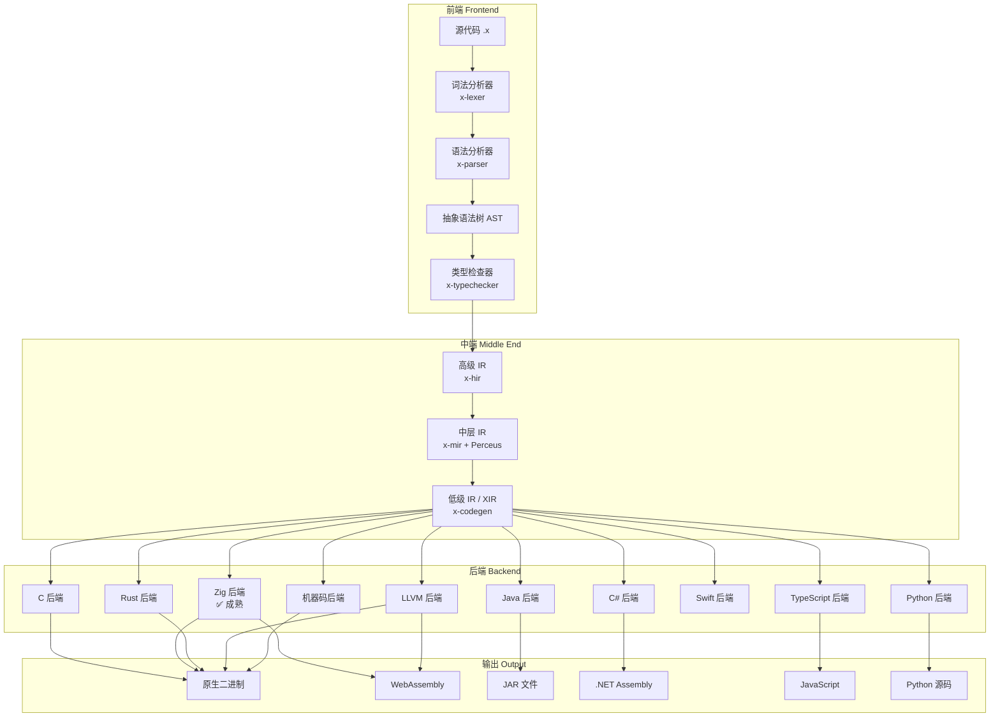

# X 语言编译器架构

> 本文描述 X 语言编译器的完整架构设计，涵盖前端、中端和十大后端。

## 概述

X 编译器采用经典的三阶段架构：**前端（Frontend）**、**中端（Middle End）**、**后端（Backend）**。前端负责语言特定的分析与转换，中端进行平台无关的优化，后端针对各目标平台生成代码。

```
┌─────────────────────────────────────────────────────────────────────────────┐
│                              X 编译器架构                                    │
├────────────────┬─────────────────────────┬─────────────────────────────────┤
│     前端       │         中端            │            后端                  │
│   Frontend     │      Middle End         │           Backend               │
├────────────────┼─────────────────────────┼─────────────────────────────────┤
│  词法分析      │   HIR (高级 IR)         │   C 后端                        │
│  语法分析      │   MIR (中层 IR)         │   Zig 后端                      │
│  语义分析      │   LIR (低级 IR) = XIR   │   Rust 后端                     │
│  → AST         │   (Perceus 在 MIR 阶段) │   Java 后端                     │
│                │                         │   C# 后端                       │
│                │                         │   TypeScript 后端               │
│                │                         │   Python 后端                   │
│                │                         │   Swift 后端                    │
│                │                         │   LLVM 后端                     │
│                │                         │   机器码后端                    │
└────────────────┴─────────────────────────┴─────────────────────────────────┘
```

---

## 一、前端（Frontend）

前端负责将源代码转换为抽象语法树（AST），并进行语义分析。

### 1.1 词法分析（Lexical Analysis）

**位置**：`compiler/x-lexer`

词法分析器将源代码字符流转换为令牌（Token）流。

```
源代码: let x = 42 + 10
            ↓
令牌流: [Let] [Ident("x")] [Eq] [Integer(42)] [Plus] [Integer(10)]
```

**主要职责**：
- 识别关键字、标识符、字面量、运算符、分隔符
- 过滤空白和注释
- 记录令牌位置信息（行号、列号），用于错误报告

**实现要点**：
- 使用 `logos` 库实现高效词法分析
- 支持完整的 Unicode 标识符
- 提供详细的错误位置信息

### 1.2 语法分析（Syntax Analysis）

**位置**：`compiler/x-parser`

语法分析器根据语法规则，将令牌流构建为抽象语法树（AST）。

```
令牌流: [Let] [Ident("x")] [Eq] [Integer(42)] [Plus] [Integer(10)]
            ↓
AST:
    VariableDeclaration
    ├── name: "x"
    └── initializer:
            BinaryExpression
            ├── operator: Plus
            ├── left: IntegerLiteral(42)
            └── right: IntegerLiteral(10)
```

**主要职责**：
- 构建表达式树和声明节点
- 处理运算符优先级和结合性
- 支持多种声明：函数、变量、类型、模块
- 支持多种表达式：算术、逻辑、调用、匹配、管道等

**AST 节点类型**：
- 声明：`FunctionDecl`、`VariableDecl`、`RecordDecl`、`EnumDecl`、`ClassDecl`、`InterfaceDecl`
- 表达式：`BinaryExpr`、`UnaryExpr`、`CallExpr`、`MatchExpr`、`LambdaExpr`、`PipeExpr`
- 语句：`IfStmt`、`WhileStmt`、`ForStmt`、`ReturnStmt`、`BlockStmt`
- 类型：`NamedType`、`GenericType`、`FunctionType`、`TupleType`

### 1.3 语义分析（Semantic Analysis）

**位置**：`compiler/x-typechecker`

语义分析器对 AST 进行类型检查和语义验证。

```
AST (无类型)
     ↓
类型检查、作用域解析、效果推断
     ↓
Typed AST (带类型标注)
```

**主要职责**：
- **类型推断**：基于 Hindley-Milner 算法进行全局类型推断
- **类型检查**：验证表达式类型、函数签名、接口实现
- **作用域解析**：解析标识符绑定、处理遮蔽规则
- **效果推断**：推断函数的副作用（IO、Async、Throws 等）
- **错误收集**：收集并报告多个语义错误

**类型系统特性**：
- 代数数据类型（ADT）：`enum`（sum type）+ `record`（product type）
- 参数多态：泛型函数与泛型类型
- 高阶类型：类型构造器、类型类
- 子类型：用于结构化类型和效果系统

---

## 二、中端（Middle End）

中端负责平台无关的优化和转换，生成多层中间表示（IR）。

### 2.1 中间表示层次

```
AST (抽象语法树)
     ↓ Lowering
HIR (高级中间表示)
     ↓ Lowering
MIR (中层中间表示) ← Perceus 内存分析
     ↓ Lowering
LIR (低级中间表示) = XIR
     ↓
    各后端
```

中端由三层 IR 组成：**HIR → MIR → LIR**。LIR 即是后端的统一输入（XIR），Perceus 内存分析在 MIR 阶段进行。

### 2.2 HIR - 高级中间表示

**位置**：`compiler/x-hir`

HIR 是 AST 的简化版本，保留了高级语义结构，但去除了语法糖。

**特点**：
- 显式类型标注（由类型检查器填充）
- 解析后的模式匹配（非原始语法）
- 统一的函数表示（lambda 提升）
- 模块级别的组织结构

**HIR 节点示例**：
```rust
pub struct Function {
    pub name: String,
    pub type_params: Vec<TypeParam>,
    pub params: Vec<Param>,
    pub return_type: Type,
    pub body: Block,
    pub effects: Vec<Effect>,
}

pub struct Match {
    pub scrutinee: Expr,
    pub arms: Vec<MatchArm>,
    pub is_exhaustive: bool,
}
```

### 2.3 MIR - 中层中间表示

**位置**：`compiler/x-mir`

MIR 是控制流图（CFG）形式的表示，适合进行控制流分析和数据流分析。**Perceus 内存分析在此阶段进行**。

**特点**：
- 基本块（Basic Block）组织
- 三地址码（Three-Address Code）
- 显式控制流边
- SSA 形式（静态单赋值）
- **Perceus 分析**：引用计数推断与 dup/drop 插入

**MIR 指令示例**：
```rust
pub enum Instruction {
    Assign { dest: Local, value: Operand },
    BinaryOp { dest: Local, op: BinOp, lhs: Operand, rhs: Operand },
    Call { dest: Option<Local>, func: FuncRef, args: Vec<Operand> },
    Branch { target: BasicBlock },
    CondBranch { cond: Operand, then_bb: BasicBlock, else_bb: BasicBlock },
    Return { value: Option<Operand> },
    // Perceus 指令
    Dup { dest: Local, src: Operand },
    Drop { value: Operand },
    Reuse { dest: Local, src: Operand },
}
```

**MIR 阶段处理**：
1. **Perceus 内存分析**：
   - 引用计数推断：静态分析每个值的引用计数变化
   - dup/drop 插入：在正确位置插入计数操作
   - 重用分析：当引用计数为 1 时，将「创建新值」优化为「原地更新」
2. **优化 Pass**：
   - 常量传播（Constant Propagation）
   - 死代码消除（Dead Code Elimination）
   - 公共子表达式消除（CSE）
   - 循环不变量外提（Loop Invariant Code Motion）

### 2.4 LIR - 低级中间表示（XIR）

**位置**：`compiler/x-codegen/src/xir.rs`

LIR（低级中间表示）即是 XIR，作为所有后端的统一输入。

**特点**：
- 虚拟寄存器
- 内存访问显式化
- 调用约定标注
- 栈帧布局
- SSA 形式

```rust
pub struct Module {
    pub name: String,
    pub functions: Vec<Function>,
    pub globals: Vec<Global>,
    pub types: Vec<TypeDefinition>,
}

pub struct Function {
    pub name: String,
    pub signature: Signature,
    pub blocks: Vec<BasicBlock>,
    pub locals: Vec<Local>,
}

pub struct BasicBlock {
    pub label: String,
    pub instructions: Vec<Instruction>,
    pub terminator: Terminator,
}
```

---

## 三、后端（Backend）

X 编译器支持十大后端，覆盖主流平台和运行时环境。

### 3.1 后端概览

| 后端 | 输出格式 | 目标平台 | 成熟度 | 用途 |
|------|----------|----------|--------|------|
| **C** | C 源码 | 所有 C 编译器支持的平台 | 🚧 早期 | 最大可移植性 |
| **Zig** | Zig 源码 | Native, Wasm | ✅ 成熟 | 系统编程、跨平台 |
| **Rust** | Rust 源码 | Native | 🚧 早期 | Rust 生态互操作 |
| **Java** | Java 源码 → 字节码 | JVM, Android | 🚧 早期 | Java 生态、大数据 |
| **C#** | C# 源码 → CIL | .NET, Unity | 🚧 早期 | Windows、游戏开发 |
| **TypeScript** | TypeScript 源码 | Node.js, 浏览器 | 🚧 早期 | Web 开发 |
| **Python** | Python 源码 | CPython | 🚧 早期 | 数据科学、AI |
| **Swift** | Swift 源码 | iOS, macOS | 📋 规划 | Apple 生态 |
| **LLVM** | LLVM IR | Native, Wasm | 🚧 早期 | 深度优化 |
| **机器码** | 原生二进制 | x86_64, ARM64 | 📋 规划 | 极速编译、调试 |

### 3.2 后端分类

```
后端
├── 源码翻译型
│   ├── C         → C 源码
│   ├── Zig       → Zig 源码
│   ├── Rust      → Rust 源码
│   ├── Java      → Java 源码 (阶段一) → JVM 字节码 (阶段二)
│   ├── C#        → C# 源码 (阶段一) → CIL 字节码 (阶段二)
│   ├── TypeScript→ TypeScript 源码
│   ├── Python    → Python 源码
│   └── Swift     → Swift 源码
│
├── 字节码型
│   ├── LLVM      → LLVM IR → Native / Wasm
│   └── (阶段二) Java 字节码, CIL 字节码
│
└── 原生型
    └── 机器码     → 直接生成 x86_64 / ARM64
```

### 3.3 C 后端

**位置**：`compiler/x-codegen/src/c_backend.rs`（规划中）

C 后端将 LIR 翻译为 C 源码，实现最大可移植性。

```
LIR → C 源码 → GCC/Clang/MSVC → Native Binary
```

**适用场景**：
- 嵌入式平台
- 遗留系统
- 需要 C FFI 的场景

### 3.4 Zig 后端 ✅

**位置**：`compiler/x-codegen/src/zig_backend.rs`

Zig 后端是当前最成熟的后端，将 LIR 翻译为 Zig 源码。

```
LIR → Zig 源码 → Zig 编译器 → Native Binary / Wasm
```

**优势**：
- Zig 自带 LLVM 后端，支持交叉编译
- 无运行时依赖
- 优秀的 Wasm 支持
- 简洁的 C FFI

**编译命令**：
```bash
# 编译为原生可执行文件
x compile hello.x -o hello

# 编译为 WebAssembly
x compile hello.x --target wasm -o hello.wasm
```

### 3.5 Rust 后端

**位置**：`compiler/x-codegen/src/rust_backend.rs`

Rust 后端将 LIR 翻译为 Rust 源码。

```
LIR → Rust 源码 → rustc → Native Binary
```

**适用场景**：
- 与 Rust 生态互操作
- 需要 Rust 安全保证的场景
- 利用 Rust 工具链

### 3.6 Java 后端

**位置**：`compiler/x-codegen/src/java_backend.rs`

Java 后端分两个阶段：

**阶段一（当前）**：
```
LIR → Java 源码 → javac → JVM 字节码 (.class)
```

**阶段二（成熟后）**：
```
LIR → JVM 字节码 (.class) [直接生成]
```

**适用场景**：
- JVM 生态系统（Spring、Hadoop、Spark）
- Android 开发
- 企业级应用
- 大数据处理

**编译命令**：
```bash
# 阶段一：生成 Java 源码并编译
x compile hello.x --target java -o hello.jar
```

### 3.7 C# 后端

**位置**：`compiler/x-codegen/src/csharp_backend.rs`

C# 后端同样分两个阶段：

**阶段一（当前）**：
```
LIR → C# 源码 → dotnet build → .NET Assembly (.dll/.exe)
```

**阶段二（成熟后）**：
```
LIR → CIL 字节码 (.dll/.exe) [直接生成]
```

**适用场景**：
- Windows 平台开发
- .NET 生态系统（ASP.NET、WPF、MAUI）
- Unity 游戏开发
- Azure 云服务

**编译命令**：
```bash
# 阶段一：生成 C# 源码并编译
x compile hello.x --target csharp -o hello.dll
```

### 3.8 TypeScript 后端

**位置**：`compiler/x-codegen/src/typescript_backend.rs`

TypeScript 后端将 LIR 翻译为 TypeScript 源码。

```
LIR → TypeScript 源码 → tsc → JavaScript
```

**适用场景**：
- Web 前端开发
- Node.js 后端开发
- Electron 桌面应用
- React/Vue/Angular 集成

**编译命令**：
```bash
x compile hello.x --target typescript -o hello.ts
```

### 3.9 Python 后端

**位置**：`compiler/x-codegen/src/python_backend.rs`

Python 后端将 LIR 翻译为 Python 源码。

```
LIR → Python 源码 → CPython 解释执行
```

**适用场景**：
- 数据科学和机器学习（NumPy、Pandas、PyTorch）
- AI/ML 模型开发
- 快速原型开发
- Python 生态互操作

**编译命令**：
```bash
x compile hello.x --target python -o hello.py
```

### 3.10 Swift 后端

**位置**：`compiler/x-codegen/src/swift_backend.rs`（规划中）

Swift 后端将 LIR 翻译为 Swift 源码。

```
LIR → Swift 源码 → swiftc → Native Binary
```

**适用场景**：
- iOS/macOS/watchOS/tvOS 应用开发
- Apple 生态系统
- SwiftUI 集成

### 3.11 LLVM 后端

**位置**：`compiler/x-codegen-llvm`

LLVM 后端直接生成 LLVM IR，利用 LLVM 的深度优化能力。

```
LIR → LLVM IR → LLVM opt → Native Binary / Wasm
```

**输出目标**：
- **Native**：x86_64、ARM64、RISC-V 等
- **WebAssembly**：Wasm32、Wasm64

**优势**：
- 工业级优化 Pass
- 多平台支持
- 完善的工具链
- LTO（链接时优化）

**编译命令**：
```bash
# 编译为原生可执行文件
x compile hello.x --backend llvm -o hello

# 编译为 WebAssembly
x compile hello.x --backend llvm --target wasm -o hello.wasm
```

### 3.12 机器码后端

**位置**：`compiler/x-codegen-native`（规划中）

机器码后端直接生成原生机器码，无需外部编译器。

```
LIR → x86_64 / ARM64 机器码 → Native Binary
```

**设计目标**：
- **极速编译**：毫秒级编译速度，无需外部工具链
- **调试优先**：快速迭代开发
- **自举基础**：为编译器自举提供基础

**实现策略**：
- 直接生成 ELF/Mach-O/PE 可执行文件
- 支持基础优化（寄存器分配、指令选择）
- 优先保证编译速度，而非运行时性能

**编译命令**：
```bash
# 快速编译，用于调试
x compile hello.x --backend native --mode debug -o hello

# 极速编译（无优化）
x compile hello.x --backend native --mode fast -o hello
```

---

## 四、编译流水线

### 4.1 完整编译流程



### 4.2 CLI 命令

```bash
# 解释执行（开发调试）
x run hello.x

# 类型检查
x check hello.x

# 编译（默认 Zig 后端）
x compile hello.x -o hello

# 选择后端
x compile hello.x --backend zig -o hello
x compile hello.x --backend llvm -o hello
x compile hello.x --backend native -o hello  # 机器码后端

# 选择目标平台
x compile hello.x --target wasm -o hello.wasm
x compile hello.x --target jvm -o hello.jar
x compile hello.x --target dotnet -o hello.dll

# 输出中间表示（调试）
x compile hello.x --emit tokens
x compile hello.x --emit ast
x compile hello.x --emit hir
x compile hello.x --emit mir
x compile hello.x --emit lir
```

---

## 五、Crate 组织

```
x-lang/
├── compiler/
│   ├── x-lexer/              # 词法分析器
│   ├── x-parser/             # 语法分析器
│   ├── x-typechecker/        # 类型检查器
│   ├── x-hir/                # 高级 IR
│   ├── x-mir/                # 中层 IR + Perceus 内存管理
│   ├── x-codegen/            # 代码生成基础设施 + LIR/XIR
│   ├── x-codegen-llvm/       # LLVM 后端
│   ├── x-codegen-native/     # 机器码后端 (规划)
│   ├── x-interpreter/        # 树遍历解释器
│   └── x-stdlib/             # 标准库
│
├── tools/
│   ├── x-cli/                # 命令行工具
│   └── x-lsp/                # LSP 服务器
│
├── library/
│   └── stdlib/               # 标准库 (Option, Result, Prelude)
│
└── spec/
    └── x-spec/               # 规格测试
```

---

## 六、实现路线

### 阶段一：核心能力（当前）

- [x] 词法分析器
- [x] 语法分析器
- [x] AST 定义
- [x] 树遍历解释器
- [x] Zig 后端（最成熟）
- [ ] 类型检查器（完善中）
- [ ] HIR 生成

### 阶段二：中端完善

- [ ] HIR → MIR 降级
- [ ] MIR 优化 Pass
- [ ] Perceus 内存分析（在 MIR 阶段）
- [ ] MIR → LIR 降级

### 阶段三：后端扩展

- [ ] C 后端
- [ ] Rust 后端完善
- [ ] Swift 后端
- [ ] 机器码后端

### 阶段四：字节码直接生成

- [ ] Java 后端：直接生成 JVM 字节码
- [ ] C# 后端：直接生成 CIL 字节码

---

## 七、设计原则

### 7.1 统一 IR 层

LIR（XIR）作为所有后端的公共输入，实现：
- **优化共享**：中端优化一次，所有后端受益
- **后端可插拔**：新增后端只需实现 LIR → 目标格式
- **增量编译**：模块级别的独立编译

### 7.2 渐进式成熟度

- **阶段一**：源码翻译，利用现有编译器
- **阶段二**：字节码直接生成，提升性能

### 7.3 多目标支持

- **Native**：原生性能，系统编程
- **Wasm**：Web 和边缘计算
- **JVM/.NET**：企业级生态
- **Python/JS**：快速开发，生态互操作

### 7.4 编译速度优先

- 机器码后端：毫秒级编译
- 增量编译：仅重编译修改部分
- 并行编译：模块间并行

---

*X 语言编译器架构 · 2026*
