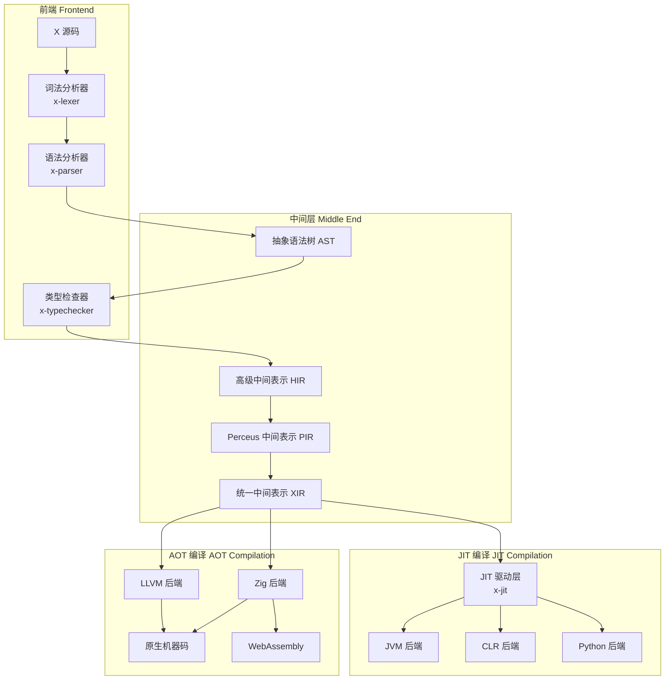
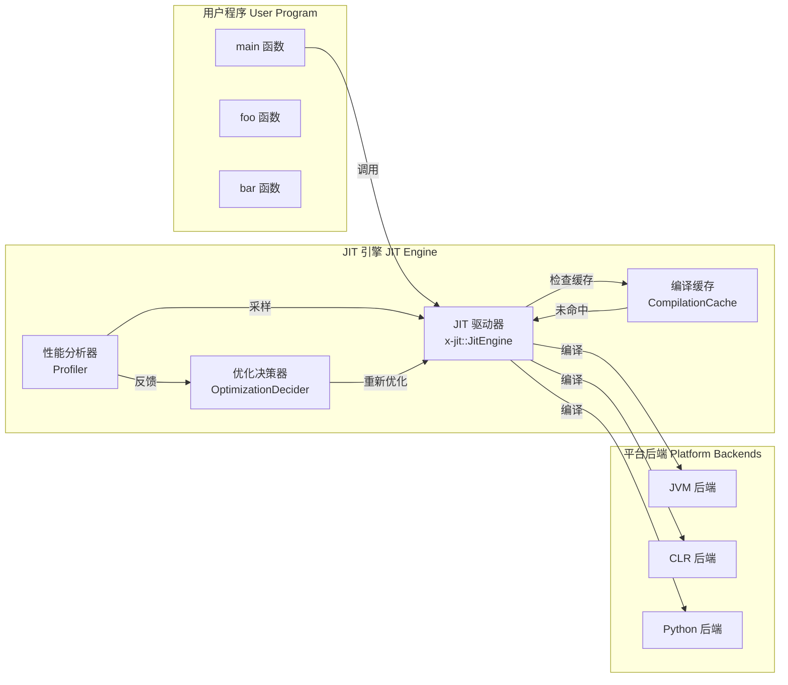

# X 语言编译器架构设计

> 支持 AOT 和多平台 JIT 的统一编译器架构

## 目录

1. [总体架构](#总体架构)
2. [中间表示层](#中间表示层)
3. [AOT 编译管道](#aot-编译管道)
4. [JIT 编译架构](#jit-编译架构)
5. [多平台 JIT 后端](#多平台-jit-后端)
6. [Crate 组织结构](#crate-组织结构)
7. [API 设计](#api-设计)

---

## 总体架构



### 核心设计原则

1. **统一 IR**：XIR 作为所有后端的公共输入
2. **共享优化**：优化层在 XIR 级别完成，所有后端受益
3. **可插拔后端**：AOT 和 JIT 后端可独立插拔
4. **延迟编译**：JIT 支持函数级别的延迟编译
5. **多模式运行**：同一程序可选择解释执行、AOT 编译或 JIT 编译

---

## 中间表示层

### 多层 IR 设计

```
X 源码
    ↓ [Lexer + Parser]
AST (抽象语法树)
    ↓ [TypeChecker]
Typed AST (带类型标注的 AST)
    ↓ [Lower]
HIR (高级中间表示) - 保留高级语义
    ↓ [Perceus]
PIR (Perceus IR) - 带 dup/drop/reuse 指令
    ↓ [Lower]
XIR (X 中间表示) - 类 SSA 的低级 IR
    ↓
AOT / JIT 后端
```

### XIR 设计增强

现有 XIR 需要增强以支持 JIT：

```rust
// compiler/x-codegen/src/xir.rs (增强版)

/// XIR 程序 - 支持模块级别的增量编译
pub struct Program {
    pub modules: Vec<Module>,
}

/// 模块 - 可独立编译的单元
pub struct Module {
    pub name: String,
    pub declarations: Vec<Declaration>,
    pub dependencies: Vec<String>,
}

/// 函数 - 支持 JIT 懒编译标记
pub struct Function {
    pub name: String,
    pub signature: FunctionSignature,
    pub body: Option<Block>,  // None 表示尚未编译
    pub is_jit_ready: bool,
    pub optimization_level: OptimizationLevel,
}

/// 优化级别
pub enum OptimizationLevel {
    None,        // JIT 快速编译
    Basic,       // 基础优化
    Standard,    // 标准优化
    Aggressive,  // 激进优化 (AOT 默认)
}
```

---

## AOT 编译管道

### AOT 编译流程

```
x compile --target native hello.x
    ↓
1. 解析源码 → AST
2. 类型检查 → Typed AST
3. 降级到 HIR → PIR → XIR
4. XIR 优化 (内联、常量传播、DCE 等)
5. 后端代码生成 (Zig/LLVM)
6. 链接 → 可执行文件
```

### 增强的 AOT 配置

```rust
// compiler/x-codegen/src/config.rs

pub struct AotConfig {
    pub target: Target,
    pub output_path: Option<PathBuf>,
    pub optimization_level: OptimizationLevel,
    pub debug_info: bool,
    pub link_time_optimization: bool,
    pub code_model: CodeModel,
    pub relocation_model: RelocationModel,
}

pub enum Target {
    // 原生目标 (由 Zig 提供)
    Native,
    Wasm,

    // 源码目标
    Zig,
    Python,

    // 字节码目标
    JvmBytecode,
    DotNetCil,
}
```

---

## JIT 编译架构

### JIT 核心设计



### JIT 引擎核心 Trait

```rust
// compiler/x-jit/src/engine.rs

/// JIT 引擎 - 主入口
pub struct JitEngine {
    config: JitConfig,
    cache: CompilationCache,
    profiler: Profiler,
    backend: Box<dyn JitBackend>,
    context: JitContext,
}

impl JitEngine {
    /// 创建新的 JIT 引擎
    pub fn new(config: JitConfig) -> Result<Self, JitError> {
        // 根据配置选择后端
        let backend = Self::create_backend(&config)?;
        Ok(Self {
            config,
            cache: CompilationCache::new(),
            profiler: Profiler::new(),
            backend,
            context: JitContext::new(),
        })
    }

    /// 编译并执行一个函数
    pub fn execute_function(
        &mut self,
        function_name: &str,
        args: &[Value],
    ) -> Result<Value, JitError> {
        // 1. 检查缓存
        if let Some(compiled) = self.cache.get(function_name) {
            return self.backend.execute(compiled, args);
        }

        // 2. 获取 XIR
        let xir = self.context.get_function_xir(function_name)?;

        // 3. JIT 编译
        let compiled = self.backend.compile_function(xir, &self.config)?;

        // 4. 缓存
        self.cache.insert(function_name, compiled.clone());

        // 5. 执行
        self.backend.execute(compiled, args)
    }

    /// 异步编译函数（后台）
    pub async fn compile_async(&mut self, function_name: &str) -> Result<(), JitError> {
        let xir = self.context.get_function_xir(function_name)?;
        let compiled = self.backend.compile_function(xir, &self.config)?;
        self.cache.insert(function_name, compiled);
        Ok(())
    }
}

/// JIT 后端 trait
pub trait JitBackend: Send + Sync {
    fn compile_function(
        &self,
        xir: &xir::Function,
        config: &JitConfig,
    ) -> Result<CompiledFunction, JitError>;

    fn execute(
        &self,
        function: &CompiledFunction,
        args: &[Value],
    ) -> Result<Value, JitError>;

    fn compile_module(
        &self,
        xir: &xir::Module,
        config: &JitConfig,
    ) -> Result<CompiledModule, JitError>;
}

/// JIT 配置
#[derive(Debug, Clone)]
pub struct JitConfig {
    pub target: JitTarget,
    pub optimization_level: JitOptimizationLevel,
    pub compilation_strategy: CompilationStrategy,
    pub enable_profiling: bool,
    pub enable_tiered_compilation: bool,
}

/// JIT 目标平台
#[derive(Debug, Clone, PartialEq, Eq)]
pub enum JitTarget {
    Jvm,
    Clr,
    Python,
    Wasm,  // 使用 Zig 编译为 WebAssembly
    Native,  // 使用 LLVM ORC JIT 或 Zig
}

/// 编译策略
#[derive(Debug, Clone, PartialEq, Eq)]
pub enum CompilationStrategy {
    Lazy,       // 函数首次调用时编译
    Eager,      // 启动时全部编译
    Adaptive,   // 根据调用频率自适应
    Background, // 后台编译
}

/// 分层编译级别
#[derive(Debug, Clone, PartialEq, Eq)]
pub enum JitOptimizationLevel {
    Tier0,  // 无优化，快速编译
    Tier1,  // 简单优化
    Tier2,  // 标准优化
    Tier3,  // 激进优化 (需要 profiling 反馈)
}
```

### 编译缓存设计

```rust
// compiler/x-jit/src/cache.rs

use std::collections::HashMap;
use std::sync::{Arc, RwLock};

/// 编译缓存 - 线程安全
pub struct CompilationCache {
    functions: RwLock<HashMap<String, Arc<CompiledFunction>>>,
    modules: RwLock<HashMap<String, Arc<CompiledModule>>>,
    stats: CacheStats,
}

impl CompilationCache {
    pub fn new() -> Self {
        Self {
            functions: RwLock::new(HashMap::new()),
            modules: RwLock::new(HashMap::new()),
            stats: CacheStats::default(),
        }
    }

    pub fn get(&self, name: &str) -> Option<Arc<CompiledFunction>> {
        let guard = self.functions.read().unwrap();
        guard.get(name).cloned()
    }

    pub fn insert(&self, name: &str, function: CompiledFunction) {
        let mut guard = self.functions.write().unwrap();
        guard.insert(name.to_string(), Arc::new(function));
        self.stats.hits += 1;
    }

    /// 基于内容哈希的缓存键
    pub fn make_key(function_name: &str, xir_hash: u64, opt_level: JitOptimizationLevel) -> String {
        format!("{function_name}_{xir_hash}_{opt_level:?}")
    }
}

#[derive(Debug, Default)]
pub struct CacheStats {
    pub hits: u64,
    pub misses: u64,
    pub compiled_functions: u64,
}
```

### 性能分析与分层编译

```rust
// compiler/x-jit/src/profiler.rs

/// 性能分析器 - 收集调用信息用于分层编译
pub struct Profiler {
    function_calls: RwLock<HashMap<String, FunctionProfile>>,
    sampling_enabled: bool,
}

#[derive(Debug, Clone)]
pub struct FunctionProfile {
    pub call_count: u64,
    pub total_execution_time_ns: u64,
    pub average_execution_time_ns: u64,
    pub last_call_timestamp: u64,
    pub optimization_tier: JitOptimizationLevel,
}

impl Profiler {
    /// 记录函数调用
    pub fn record_call(&self, function_name: &str, execution_time_ns: u64) {
        let mut guard = self.function_calls.write().unwrap();
        let profile = guard.entry(function_name.to_string())
            .or_insert_with(FunctionProfile::new);

        profile.call_count += 1;
        profile.total_execution_time_ns += execution_time_ns;
        profile.average_execution_time_ns =
            profile.total_execution_time_ns / profile.call_count;
    }

    /// 判断是否应该升级优化级别
    pub fn should_upgrade_tier(&self, function_name: &str) -> Option<JitOptimizationLevel> {
        let guard = self.function_calls.read().unwrap();
        let profile = guard.get(function_name)?;

        let next_tier = match profile.optimization_tier {
            JitOptimizationLevel::Tier0 if profile.call_count > 10 =>
                Some(JitOptimizationLevel::Tier1),
            JitOptimizationLevel::Tier1 if profile.call_count > 100 =>
                Some(JitOptimizationLevel::Tier2),
            JitOptimizationLevel::Tier2 if profile.call_count > 1000 =>
                Some(JitOptimizationLevel::Tier3),
            _ => None,
        };

        next_tier
    }
}

/// 优化决策器
pub struct OptimizationDecider {
    profiler: Arc<Profiler>,
    recompile_queue: mpsc::Sender<RecompileTask>,
}

pub struct RecompileTask {
    pub function_name: String,
    pub target_tier: JitOptimizationLevel,
}
```

---

## 多平台 JIT 后端

### 1. JVM 后端

```rust
// compiler/x-jit-jvm/src/lib.rs

pub struct JvmBackend {
    class_loader: ClassLoader,
    bytecode_builder: BytecodeBuilder,
}

impl JvmBackend {
    pub fn new() -> Result<Self, JitError> {
        Ok(Self {
            class_loader: ClassLoader::new()?,
            bytecode_builder: BytecodeBuilder::new(),
        })
    }
}

impl JitBackend for JvmBackend {
    fn compile_function(
        &self,
        xir: &xir::Function,
        config: &JitConfig,
    ) -> Result<CompiledFunction, JitError> {
        // 1. XIR → JVM 字节码
        let class_name = format!("x/lang/generated/{}", xir.name);
        let bytecode = self.bytecode_builder.build(xir, config)?;

        // 2. 加载类
        let class = self.class_loader.define_class(&class_name, &bytecode)?;

        // 3. 获取方法句柄
        let method = class.get_method(xir.name)?;

        Ok(CompiledFunction::Jvm(JvmCompiledFunction {
            class_name,
            method,
            bytecode,
        }))
    }

    fn execute(
        &self,
        function: &CompiledFunction,
        args: &[Value],
    ) -> Result<Value, JitError> {
        match function {
            CompiledFunction::Jvm(jvm_func) => {
                // 调用 JVM 方法
                let jni_args = Self::convert_args(args);
                let result = jvm_func.method.invoke(jni_args)?;
                Self::convert_result(result)
            }
            _ => Err(JitError::InvalidBackend),
        }
    }
}
```

### 2. CLR (.NET) 后端

```rust
// compiler/x-jit-clr/src/lib.rs

use dnlib::{ModuleDef, MethodDef, ILGenerator};

pub struct ClrBackend {
    assembly_builder: AssemblyBuilder,
}

impl ClrBackend {
    pub fn new() -> Result<Self, JitError> {
        Ok(Self {
            assembly_builder: AssemblyBuilder::new("x.runtime")?,
        })
    }
}

impl JitBackend for ClrBackend {
    fn compile_function(
        &self,
        xir: &xir::Function,
        config: &JitConfig,
    ) -> Result<CompiledFunction, JitError> {
        // 1. 创建动态程序集/模块/类型
        let module = self.assembly_builder.create_module(&format!("XModule_{}", xir.name))?;
        let type_def = module.create_type(&format!("XType_{}", xir.name))?;

        // 2. XIR → CIL
        let mut method_def = type_def.create_method(
            xir.name,
            Self::convert_signature(&xir.signature),
        )?;

        let mut il = method_def.get_il_generator();
        XirToCil::lower(xir, &mut il)?;

        // 3. 保存并加载
        let assembly = self.assembly_builder.build()?;
        let method = assembly.get_method(&type_def.name, &xir.name)?;

        Ok(CompiledFunction::Clr(ClrCompiledFunction {
            method,
            assembly,
        }))
    }

    fn execute(
        &self,
        function: &CompiledFunction,
        args: &[Value],
    ) -> Result<Value, JitError> {
        match function {
            CompiledFunction::Clr(clr_func) => {
                let clr_args = Self::convert_args(args);
                let result = clr_func.method.invoke(clr_args)?;
                Self::convert_result(result)
            }
            _ => Err(JitError::InvalidBackend),
        }
    }
}
```

### 3. Python 后端

```rust
// compiler/x-jit-python/src/lib.rs

use pyo3::{Python, PyObject, types::PyModule};

pub struct PythonBackend {
    py: Python<'static>,
    module: PyObject,
}

impl PythonBackend {
    pub fn new() -> Result<Self, JitError> {
        let gil = Python::acquire_gil();
        let py = gil.python();

        // 创建主模块
        let module = PyModule::new(py, "x_runtime")?;

        Ok(Self {
            py,
            module: module.into(),
        })
    }
}

impl JitBackend for PythonBackend {
    fn compile_function(
        &self,
        xir: &xir::Function,
        config: &JitConfig,
    ) -> Result<CompiledFunction, JitError> {
        // 1. XIR → Python AST
        let py_ast = XirToPythonAst::lower(xir)?;

        // 2. Python AST → 源码字符串
        let source = PythonAstPrinter::print(&py_ast)?;

        // 3. 编译源码
        let code = self.py.compile(
            &source,
            &format!("<x-generated-{}.py>", xir.name),
            "exec",
        )?;

        // 4. 在模块中执行
        self.py.run_code(&code, Some(&self.module), None)?;

        // 5. 获取函数对象
        let func = self.module.getattr(self.py, xir.name)?;

        Ok(CompiledFunction::Python(PythonCompiledFunction {
            function: func,
            source_code: source,
        }))
    }

    fn execute(
        &self,
        function: &CompiledFunction,
        args: &[Value],
    ) -> Result<Value, JitError> {
        match function {
            CompiledFunction::Python(py_func) => {
                let py_args = Self::convert_args(self.py, args);
                let result = py_func.function.call1(self.py, py_args)?;
                Self::convert_result(self.py, result)
            }
            _ => Err(JitError::InvalidBackend),
        }
    }
}
```

### 4. Wasm 后端 (由 Zig 提供)

```rust
// compiler/x-codegen-zig/src/lib.rs

use std::process::Command;

pub struct ZigBackend {
    target: ZigTarget,
}

#[derive(Debug, Clone)]
pub enum ZigTarget {
    Native,
    Wasm,
}

impl ZigBackend {
    pub fn new(target: ZigTarget) -> Self {
        Self { target }
    }

    pub fn compile(&self, xir: &xir::Module) -> Result<Vec<u8>, ZigError> {
        // 1. XIR → Zig 源码
        let zig_source = XirToZig::lower(xir, &self.target)?;

        // 2. 使用 Zig 编译器编译
        let output = match self.target {
            ZigTarget::Wasm => Command::new("zig")
                .args(&["build-lib", "-target", "wasm32", "-O2"])
                .output(),
            ZigTarget::Native => Command::new("zig")
                .args(&["build-exe", "-O2"])
                .output(),
        }?;

        if !output.status.success() {
            return Err(ZigError::CompilationFailed(
                String::from_utf8_lossy(&output.stderr).to_string(),
            ));
        }

        // 3. 返回编译产物
        Ok(output.stdout)
    }
}
```

---

## Crate 组织结构

### 完整 Crate 列表

```
x-lang/
├── compiler/
│   ├── x-lexer/              # 词法分析器 (已存在)
│   ├── x-parser/             # 语法分析器 (已存在)
│   ├── x-typechecker/        # 类型检查器 (已存在)
│   ├── x-hir/                # HIR (已存在)
│   ├── x-perceus/            # Perceus 分析 (已存在)
│   ├── x-codegen/            # 公共代码生成 + XIR (已存在)
│   │
│   ├── x-jit/                # [新增] JIT 核心引擎
│   ├── x-jit-jvm/            # [新增] JVM JIT 后端
│   ├── x-jit-clr/            # [新增] CLR JIT 后端
│   ├── x-jit-python/         # [新增] Python JIT 后端
│   │
│   ├── x-codegen-llvm/       # LLVM AOT 后端 (已存在)
│   ├── x-codegen-zig/        # [新增] Zig AOT 后端 (Native + Wasm)
│   ├── x-codegen-jvm/        # JVM AOT 后端 (已存在)
│   ├── x-codegen-dotnet/     # .NET AOT 后端 (已存在)
│   │
│   └── x-interpreter/        # 树遍历解释器 (已存在)
│
├── library/
│   ├── x-stdlib/             # 标准库 (已存在)
│   ├── x-runtime-jvm/        # [新增] JVM 运行时支持
│   ├── x-runtime-clr/        # [新增] CLR 运行时支持
│   ├── x-runtime-python/     # [新增] Python 运行时支持
│   └── x-runtime-wasm/       # [新增] Wasm 运行时支持 (由 Zig 提供)
│
├── tools/
│   ├── x-cli/                # CLI (已存在)
│   └── x-lsp/                # [新增] LSP 服务器
│
└── spec/
    └── x-spec/               # 规格测试 (已存在)
```

### 新增 Crate 依赖关系

```toml
# compiler/x-jit/Cargo.toml
[package]
name = "x-jit"
version = "0.1.0"

[dependencies]
x-codegen = { path = "../x-codegen" }
x-hir = { path = "../x-hir" }

# JIT 后端可选依赖
x-jit-jvm = { path = "../x-jit-jvm", optional = true }
x-jit-clr = { path = "../x-jit-clr", optional = true }
x-jit-python = { path = "../x-jit-python", optional = true }

[features]
default = []
jvm = ["x-jit-jvm"]
clr = ["x-jit-clr"]
python = ["x-jit-python"]
all = ["jvm", "clr", "python"]
```

---

## API 设计

### CLI 扩展

```bash
# AOT 编译 (已有)
x compile hello.x -o hello
x compile --target native hello.x -o hello
x compile --target wasm hello.x -o hello.wasm
x compile --target jvm hello.x -o hello.jar

# JIT 运行 (新增)
x jit --target jvm hello.x
x jit --target python hello.x

# REPL 模式 (新增)
x repl --target jvm

# 混合模式 (新增)
x run --jit hello.x          # 自动选择 AOT + JIT 混合
x run --jit-tiered hello.x   # 启用分层编译
```

### 编程 API

```rust
// 作为库使用的 API 示例

use x_jit::{JitEngine, JitConfig, JitTarget, CompilationStrategy};

fn main() -> Result<(), Box<dyn std::error::Error>> {
    // 1. 创建 JIT 引擎
    let config = JitConfig {
        target: JitTarget::Jvm,
        optimization_level: JitOptimizationLevel::Tier0,
        compilation_strategy: CompilationStrategy::Adaptive,
        enable_profiling: true,
        enable_tiered_compilation: true,
    };

    let mut engine = JitEngine::new(config)?;

    // 2. 加载 XIR 模块
    let program = x_parser::parse_file("hello.x")?;
    let typed = x_typechecker::check(program)?;
    let xir = x_codegen::lower_to_xir(typed)?;
    engine.load_module(xir)?;

    // 3. 执行函数
    let args = vec![Value::Integer(42)];
    let result = engine.execute_function("compute", &args)?;
    println!("Result: {:?}", result);

    // 4. 异步预编译热点函数
    engine.compile_async("hot_function").await?;

    Ok(())
}
```

### REPL API

```rust
// REPL 示例

use x_jit::{Repl, JitTarget};

#[tokio::main]
async fn main() -> Result<(), Box<dyn std::error::Error>> {
    let mut repl = Repl::new(JitTarget::Jvm);

    println!("X REPL (JVM backend)");
    println!("Type ':quit' to exit\n");

    loop {
        let input = repl.read_line("> ")?;

        match input.trim() {
            ":quit" => break,
            ":clear" => repl.clear(),
            ":env" => repl.print_environment(),
            line => {
                match repl.eval(line) {
                    Ok(value) => println!("{:?}", value),
                    Err(e) => eprintln!("Error: {}", e),
                }
            }
        }
    }

    Ok(())
}
```

---

## 实现阶段

### Phase 1: JIT 核心框架
- [ ] `x-jit` crate 基础结构
- [ ] JIT 引擎 trait 定义
- [ ] 编译缓存实现
- [ ] 与 XIR 集成

### Phase 2: Zig AOT 后端 (Native + Wasm)
- [ ] `x-codegen-zig` crate
- [ ] XIR → Zig C 代码生成
- [ ] Zig 编译器集成
- [ ] Native 和 Wasm 编译测试

### Phase 3: Python JIT 后端
- [ ] `x-jit-python` crate
- [ ] XIR → Python AST/源码
- [ ] PyO3 集成
- [ ] 基本执行测试

### Phase 4: JVM JIT 后端
- [ ] `x-jit-jvm` crate
- [ ] XIR → JVM 字节码
- [ ] JNI 集成
- [ ] 类加载器实现

### Phase 5: CLR JIT 后端
- [ ] `x-jit-clr` crate
- [ ] XIR → CIL
- [ ] .NET 宿主集成
- [ ] 动态程序集生成

### Phase 6: 优化与工具
- [ ] 分层编译
- [ ] 性能分析器
- [ ] 优化反馈循环
- [ ] REPL 实现
- [ ] CLI 集成

---

## 总结

本架构设计提供了：

1. **统一 IR 层**：XIR 作为 AOT 和 JIT 的公共输入
2. **可插拔 JIT 后端**：支持 JVM、CLR、Python（新增）
3. **Zig AOT 后端**：统一使用 Zig 提供 Native 和 Wasm 支持
4. **分层编译**：基于 profiling 的自适应优化
5. **缓存机制**：避免重复编译
6. **完整的工具链**：CLI、REPL、库 API

这个设计使得 X 语言可以灵活地在不同场景下选择最优的执行方式：
- **AOT**：适合需要最高性能、启动延迟不敏感的场景
  - 使用 Zig 编译为 Native 或 Wasm
  - 使用 LLVM 编译为 Native
  - 编译为 JVM 字节码或 .NET CIL 字节码
  - 编译为 Python 源码
- **JIT**：适合需要快速启动、交互式使用、动态生成代码的场景
- **混合**：热点函数 JIT 优化，其他函数 AOT 编译
